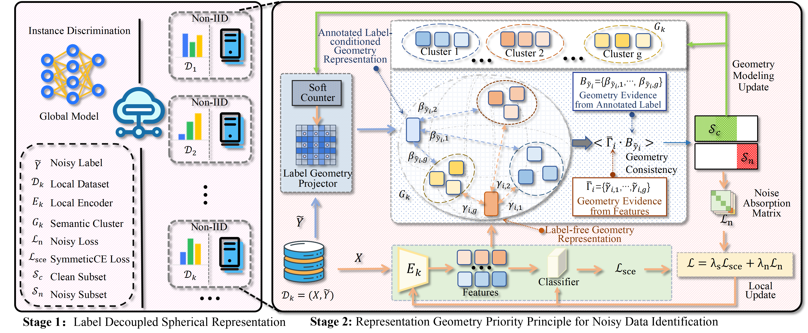

# FedRG: Unleashing the Representation Geometry for Federated Learning with Noisy Clients

[CVPR 2026]

This repository contains the official implementation of "FedRG: Unleashing the Representation Geometry for Federated Learning with Noisy Clients".




## Overview

Federated learning under noisy supervision is hard for a simple reason: in heterogeneous client environments, scalar loss is no longer a reliable signal for noisy-sample detection. FedRG rethinks noisy-label learning from the representation side. It first learns label-decoupled spherical representations with self-supervised training, then fits a vMF-based geometry model on the hypersphere, compares label-free geometric evidence with label-conditioned evidence, and finally performs robust local optimization with a personalized noise absorption matrix.

## Highlights

- A two-stage federated pipeline for noisy-client learning:
	- Stage I: SimCLR-based federated pretraining for label-decoupled spherical representations.
	- Stage II: geometry-based noisy-sample identification and robust optimization.
- A representation geometry priority principle that avoids relying directly on unstable small-loss heuristics.
- A client-specific noise absorption matrix for robust training on noisy subsets.

## Main Experimental Setting

We evaluate FedRG on CIFAR-10, CIFAR-100, and SVHN. Unless otherwise stated, the data are partitioned with a Dirichlet distribution with concentration parameter `alpha = 0.1`, and the local label noise rate is fixed to `epsilon = 0.4`. We consider both globalized and localized corruption, each under symmetric and pairflip noise. Most experiments use `K = 10` clients, and we additionally report results on CIFAR-10 with `K = 100` clients.

Default training settings used in the paper:

- Optimizer: SGD
- Learning rate: `0.01`
- Momentum: `0.9`
- Weight decay: `5e-4`
- Batch size: `64`
- Stage I rounds: `150`
- Stage II rounds: `350`
- Number of semantic clusters `|G|`:
	- CIFAR-10: `10`
	- CIFAR-100: `50`
	- SVHN: `10`


## Repository Structure

The public codebase is organized around the following components:

```text
.
├── conf/                    # experiment configs
├── data_preprocessing/      # dataset construction, partitioning, and noise injection
├── model/                      # backbone networks and model manager
├── loss/                       # loss functions, including SCE
├── utils/                      # metrics, logging, recorders, helper functions
├── baseFedAvg/                 # federated training framework
├── FedRG/                      # FedRG-specific client/server/manager logic
├── main.py                   # runnable experiment scripts
└── README.md
```

If your local repository uses different names, please replace this section with the exact released layout before making the repository public.


## Citation

If you find this repository useful, please cite:

```bibtex
@inproceedings{wen2026fedrg,
  title={FedRG: Unleashing the Representation Geometry for Federated Learning with Noisy Clients},
  author={Tian Wen and Zhiqin Yang and Yonggang Zhang and Xuefeng Jiang and Hao Peng and Yuwei Wang and Bo Han},
  booktitle={Proceedings of the IEEE/CVF Conference on Computer Vision and Pattern Recognition},
  year={2026}
}
```


## Contact

For questions about the paper or code, please contact us <marrowd611@gmail.com>.